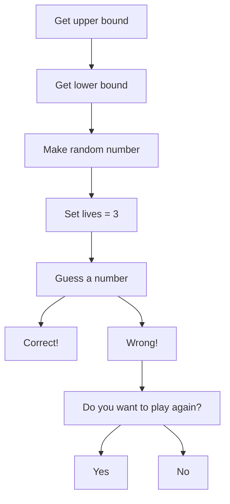

```mermaid
flowchart TD
  A[Get upper bound] --> B[Get lower bound]
  B --> C[Make random number]
  C --> D[Set lives = 3]
  D --> E[Guess a number]
  E --> F[Correct!]
  E --> G[Wrong!]
  G --> H[Do you want to play again?]
  H --> I[Yes]
  H --> J[No]
```
