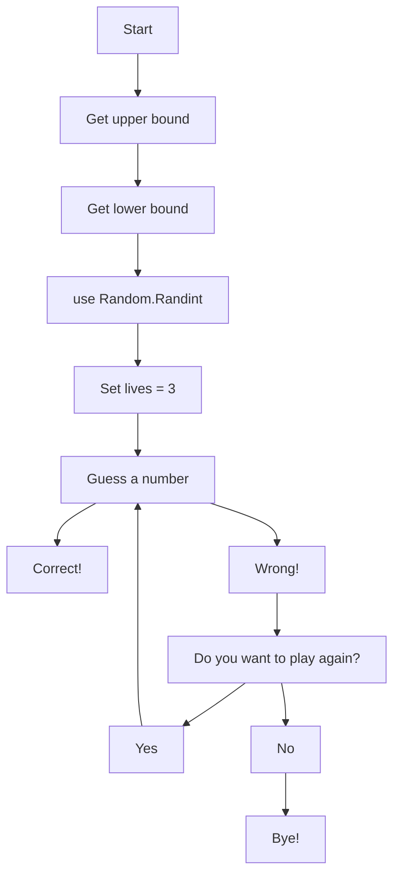

```mermaid
flowchart TD
  St[Start]-->A
  A[Get upper bound]-->B[Get lower bound]
  B-->C[use Random.Randint]
  C-->D[Set lives = 3]
  D-->E[Guess a number]
  E-->F[Correct!]
  E-->G[Wrong!]
  G-->H[Do you want to play again?]
  H-->I[Yes]
  I-->E
  H-->J[No]
  J-->Z[Bye!]
```
