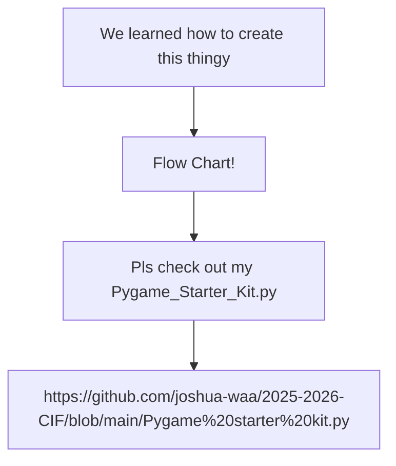

This is a series of Python classes from CIF(Coding Is Fun)
We learned printing, input, turtle, and pygame.

```mermaid
flowchart TD
  St[We learned how to create this thingy]-->A
  A[Flow Chart!]-->B
  B[Pls check out my Pygame_Starter_Kit.py]-->C
  C[https://github.com/joshua-waa/2025-2026-CIF/blob/main/Pygame%20starter%20kit.py]

``` 
